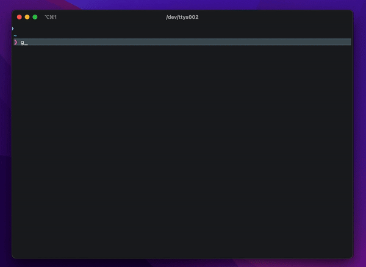
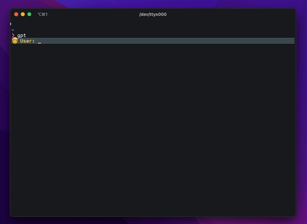

<div align="center">

<h1>

console-chat-gpt v4

</h1>

**Your Ultimate CLI Companion for Chatting with AI Models**

_Enjoy seamless interactions with **ChatGPT**, **MistralAI**, **Claude by Anthropic**, **Grok by xAI** and **Gemini by Google** directly from your command line. </br>Elevate your chat experience with efficiency and ease._

<h3>

[Homepage](https://github.com/amidabuddha/consoleChatGPT) | [Examples](/examples)

</h3>

 <h4 align="center">
  <a href="https://github.com/amidabuddha/consoleChatGPT/blob/main/LICENSE.md">
  
  </a>
  
  
  
  
  
</h4>

</div>

---

# Table of Contents

- [Features](#features)
- [Installation and Usage](#installation-and-usage)
- [Examples](#examples)
- [Contributing](#contributing)

---

**DISCLAIMER:**
The intention and implementation of this code are entirely unconnected and unrelated to OpenAI, MistralAI, Anthropic, xAI, Google AI or any other related parties. There is no affiliation
or relationship with OpenAI, MistralAI, Anthropic, xAI, Google or their subsidiaries in any form.

---

## Features

- :new: Unified chat completion function separated as independent library. Use `pip install unichat` to add it to your application for seamless cross-provider API experience. The [Source code](https://github.com/amidabuddha/unichat) is public on GitHub :new:
- **AI Managed mode** Based on the complexity of the task, automatically determines which model to use.
- :star: [**OpenAI Assistants Beta**](https://platform.openai.com/docs/assistants/overview) fully supported :star:
- **Configuration File**: Easily customize the app's settings through the `config.toml` file for complete control over
  how the app works. Also supported in-app via the `settings` command.
- **Role selection**: Users can define the role of the AI in the conversation, allowing for a more personalized and
  interactive experience.
- **Temperature Control**: Adjust the temperature of generated responses to control creativity and randomness in the
  conversation.
- **Command Handling**: The app responds to various commands entered by the user for easy and intuitive interaction.
- **Image input**: with selected models.
- **Error Handling**: Clear and helpful error messages to easily understand and resolve any issues.
- **Conversation History**: Review previous interactions and save conversations for future reference, providing context
  and continuity.
- **Graceful Exit**: Smoothly handle interruptions, ensuring conversations are saved before exiting to avoid loss of
  progress.
- **A nice team**: Actively adding features, open for ideas and fixing bugs.

Overall, this app focuses on providing a user-friendly and customizable experience with features that enhance
personalization, control, and convenience.

---

## Installation and Usage

> The script works fine on Linux and MacOS terminals. For Windows it's recommended to use [WSL](https://learn.microsoft.com/en-us/windows/wsl/).

1. Clone the repository:

   ```shell
   git clone https://github.com/amidabuddha/console-chat-gpt.git
   ```

2. Go inside the folder:

   ```shell
   cd console-chat-gpt
   ```

3. Install the necessary dependencies:

   ```shell
   python3 -m pip install -r requirements.txt
   ```

4. Get your API key from [OpenAI](https://platform.openai.com/account/api-keys), [MistralAI](https://console.mistral.ai/user/api-keys/), [Anthropic](https://console.anthropic.com/settings/keys), [xAI](https://console.x.ai/), [Google AI Studio](https://aistudio.google.com/apikey) depending on your selected LLM.

5. The `config.toml.sample` will be automatically copied into `config.toml` upon first run, with a prompt to enter your API key/s. Feel free to change any of the other defaults that are not available in the `settings` in-app menu as per your needs.

6. Run the executable:

   ```shell
   python3 main.py
   ```

   > Pro-tip:
   > Create an alias for the executable to run from anywhere.

7. Use the `help` command within the chat to check the available options.

8. Enjoy

---

## Examples

- Prompt example:

  

- Markdown visualization example:

  

- Settings and help:

  

> You can find more examples on our [Examples page](EXAMPLES.md).

---

## Contributing

Contributions are welcome! If you find any bugs, have feature requests, or want to contribute improvements, please open an issue or submit a pull request.
